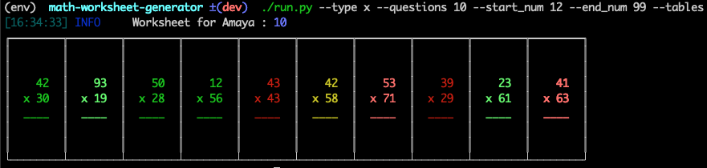

### Simple CLI application to generate mathematics worksheet for the following operations

- addition worksheet
- subtraction worksheet
- multiplication worksheet
- can specify to generate variable number of questions
- mix mode, generates all 3 types of questions worksheets
- saves the generated worksheet in colored HTML file and PDF file
- Randomized questions always, so its never the same set of questions

### To Run
```
./quick_start.sh
```

# Usage
```
Usage: run.py [OPTIONS]

  A CLI app for creating HTML & PDF math worksheets

Options:
  -t, --type [+|-|x|mix]   type of calculation: +: Addition; -: Subtraction;
                           x: Multiplication; mix: Mixed; (default: +)
  -q, --questions INTEGER  Number of questions to generate
  --start_num INTEGER      Starting number for questions
  --end_num INTEGER        Ending number for questions
  --tables                 Flag to enable double-digit multiplication
  -h, --help               Show this message and exit.
```
- generate 10 double-digit multiplication questions starting from 12 to 99


### TODO
- [ ] division worksheet support
- [ ] exclude certain numbers support
- [ ] support to generate answer key for the related worksheet
- [ ] auto-evaluate and score the answer sheet based on hand-writing recognition model
- [x] support for start and end values as cli arguments
